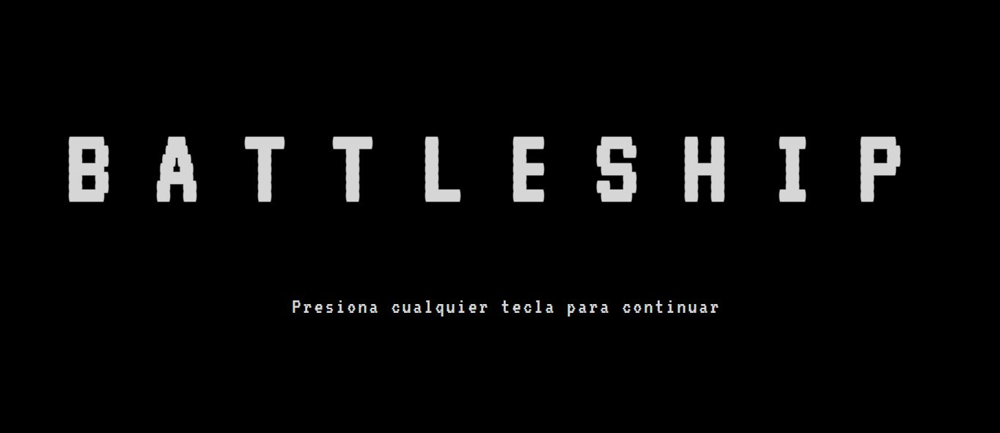
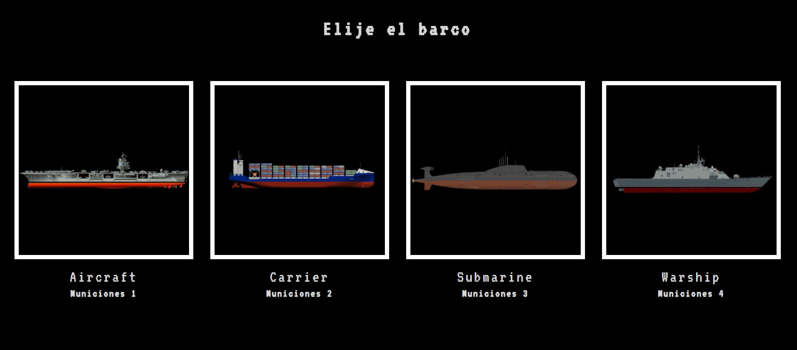
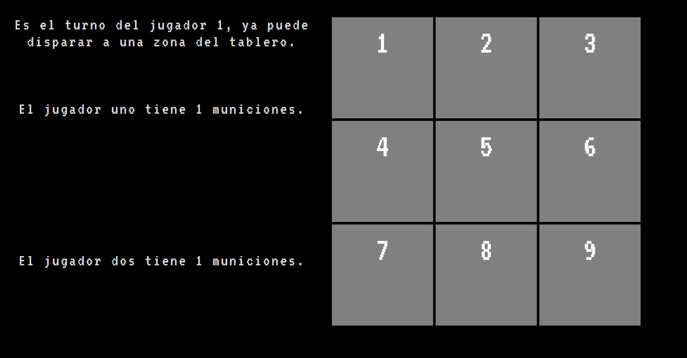

# Battleship

:speech_balloon: [Acerca del proyecto](#id1)   

:clipboard: [Características del proyecto](#id2)

:clipboard: [Instrucciones de juego](#id3)

:eye_speech_bubble: [Futuras mejoras](#id4)

:eye_speech_bubble: [Visita la página](#id5)

--------------------------

## Acerca del proyecto 

Realización de un juego de pelea como proyecto para el bootcamp de **Full Stack Developer** de [GeeksHubs Academy](https://bootcamp.geekshubsacademy.com/).

Fecha de inicio: 11 Mayo de 2021.

Fecha máxima de entrega: 16 Mayo de 2021.

## Características del proyecto

Para la realización de este trabajo contamos con las siguientes herramientas y tecnologías.

|  | Visual Code Estudio |

|  | HTML5 |

|  | CSS3 | 

|  | Git |

|  | GitHub | 

|  | Bootstrap | 

|  | JavaScript | 

## Instrucciones de juego

Para avanzar por las pantallas solo es necesario presionar cualquier tecla del teclado.

Cuando estamos en la pantalla de "Elegir barco" tienes que seleccionar el barco con el cual deseas jugar según el nivel de dificultad deseado. 

* **Nivel 1** = Municiones 4 (Tú y el barco enemigo tienen 4 tiros para hundir el barco enemigo)

* **Nivel 2** = Municiones 3 (Tú y el barco enemigo tienen 3 tiros para hundir el barco enemigo)

* **Nivel 3** = Municiones 2 (Tú y el barco enemigo tienen 3 tiros para hundir el barco enemigo)

* **Nivel 4** = Municiones 1 (Tú y el barco enemigo tienen 4 tiros para hundir el barco enemigo)

Una vez elegido ya estarás dentro del juego. En la pantalla encontraras el turno del jugador y la cantidad de municiones restantes para cada uno. Utiliza los números del teclado para elegir donde quieres disparar y suerte!

## Futuras mejoras

* Aumentar la cuadricula de juego y darles a cada barco una cantidad de cuadrantes según el modelo de barco como el juego original.

* Que el posicionamiento de los barcos en la cuadricula no sea aleatorio, que lo pueda realizar cada jugador arrastrando el barco al tablero. 

## Visita la página del proyecto en GitHub

[BattleShip](https://mlfernandez.github.io/battleShip/)

 
 

[Subir](#top)